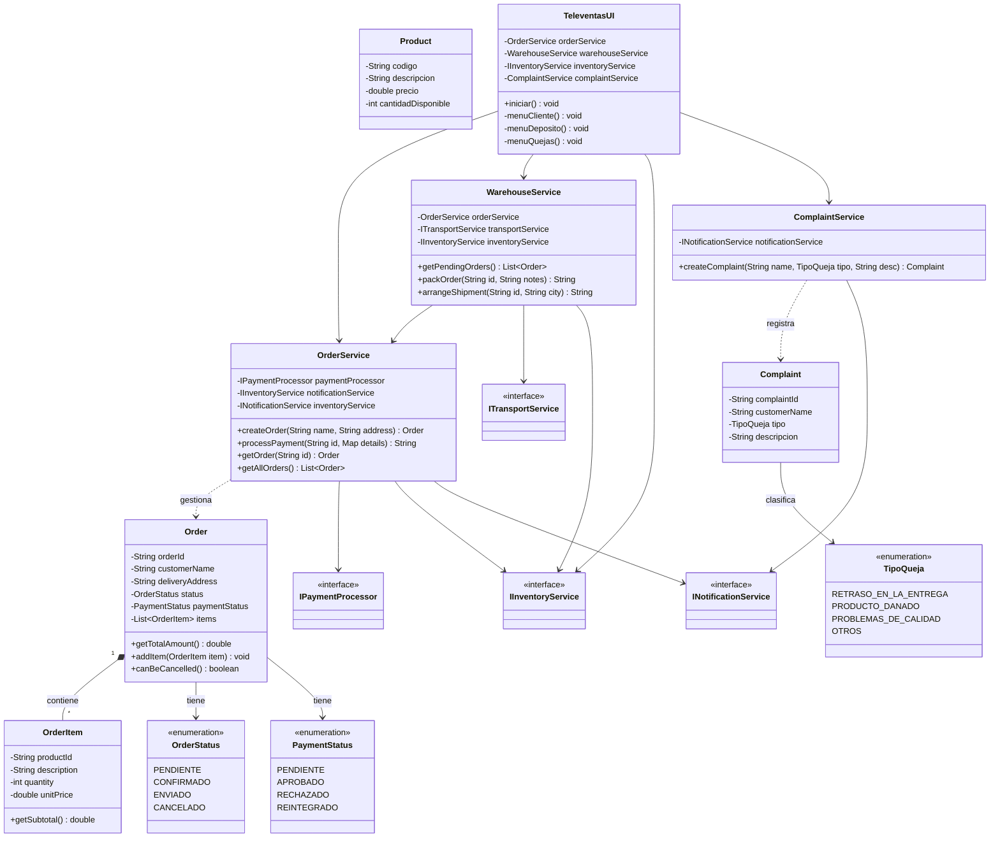

# Sistema de Gestión de Televentas

Este es el taller POO sobre las televentas diseñada para digitalizar y optimizar el ciclo de preventa, venta y postventa a distancia desarrollado en Java utilizando Programación Orientada a Objetos.

## Diagrama UML de Clases

A continuación se presenta la estructura de clases y sus relaciones:

